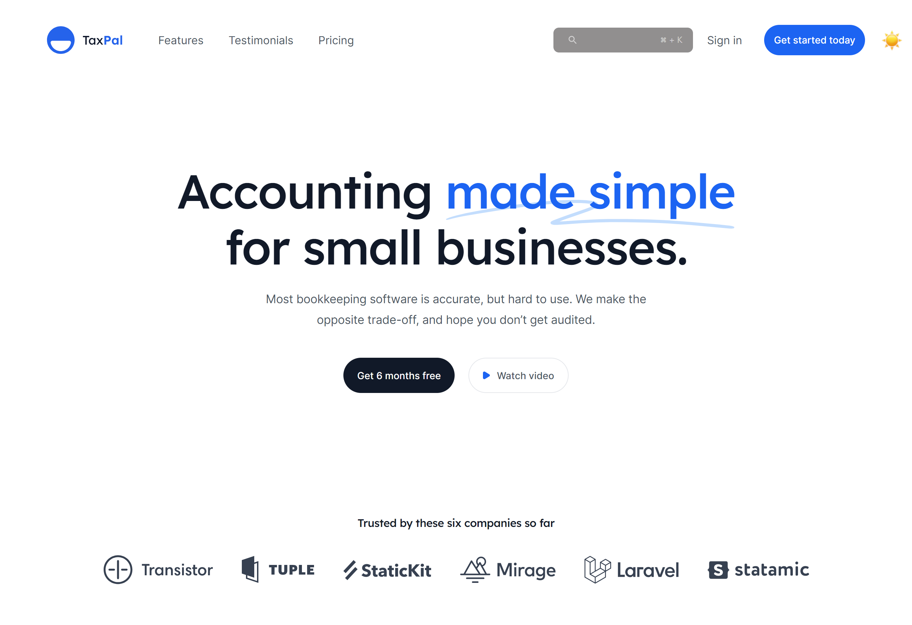
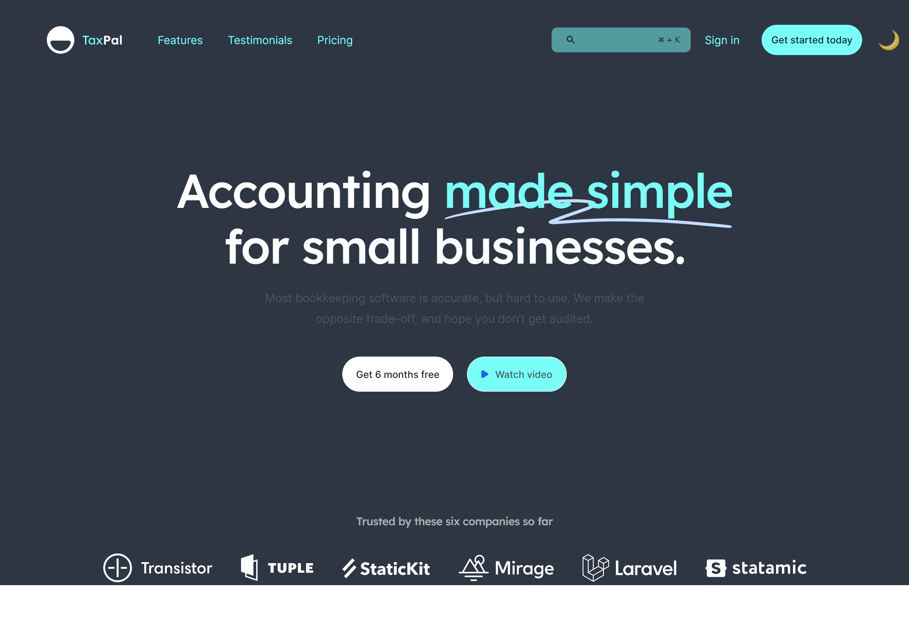
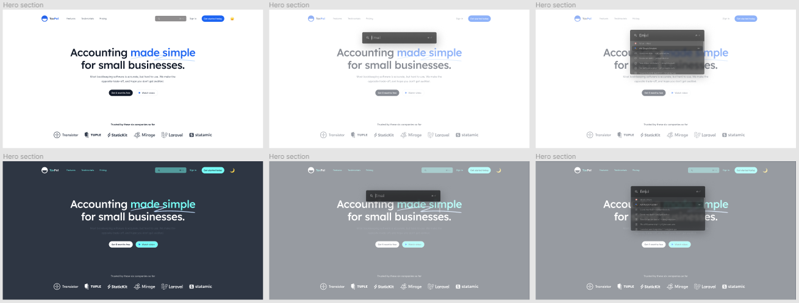

# React + zustand + tailwindcss landing page

### [Live Demo](https://liaochungyid.github.io/react-zustand-tailwind-landing-page/)

  

  

## Original design view

### [Figma Link](https://www.figma.com/file/V3G3Fk44rWVEWbvluXlQep/Zustand-Small-Project-(Copy))

  

## Available Scripts

In the project directory, you can run:

### `npm start`

Runs the app in the development mode.\
Open [http://localhost:3000](http://localhost:3000) to view it in the browser.

The page will reload if you make edits.\
You will also see any lint errors in the console.
